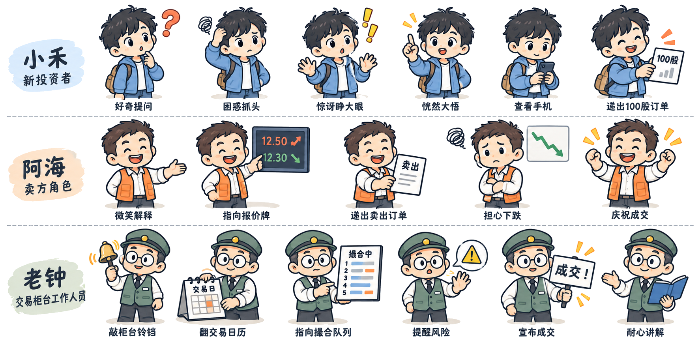
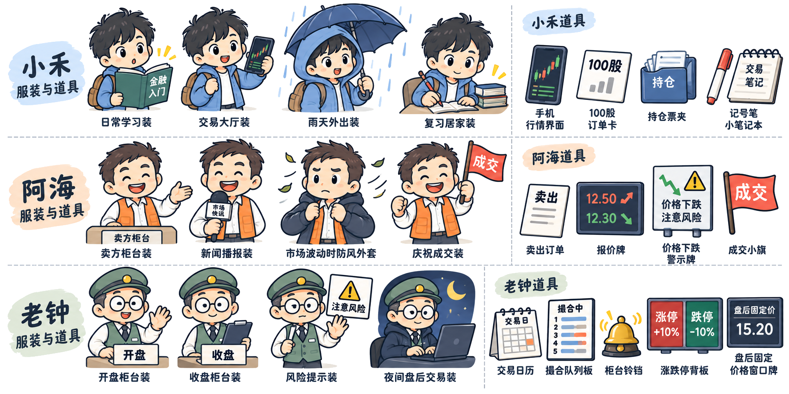
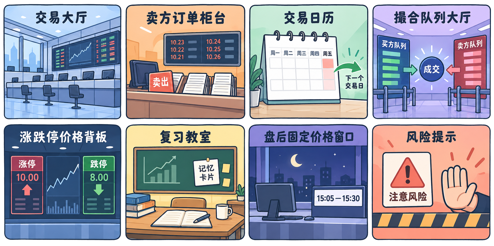
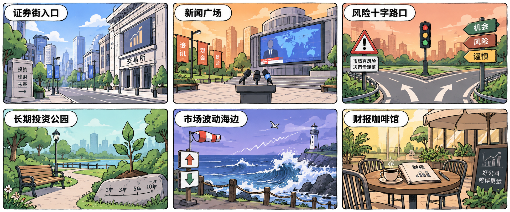
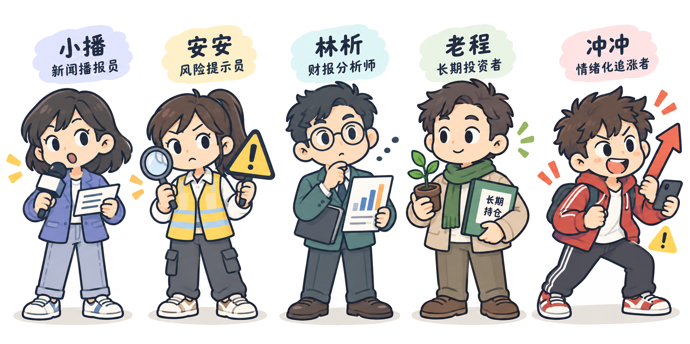
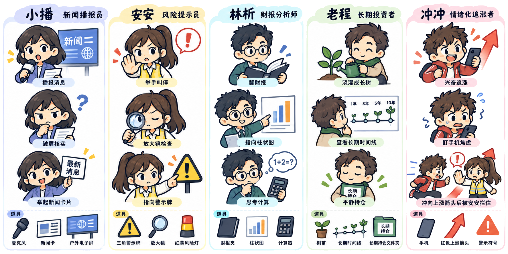

# Finance Learning 手绘漫画 Skill

一个面向中文金融学习的原创手绘漫画 Skill。

它把金融概念拆成短分镜、角色对话、场景动作、专业道具、自测题和 Anki 卡片，适合制作 A 股规则、财报分析、技术指标、量化投资、组合理论和风险管理等学习内容。

目标很简单：让抽象的金融机制变成看得懂、记得住、可以复习的漫画场景。

## 主要能力

- 用原创角色解释金融机制，而不是只放文字和公式；
- 根据知识点选择室内或户外场景；
- 使用透明角色、动作和道具叠加到场景中；
- 生成连续的角色表情、服装、道具和配色；
- 为每个知识点设计预测、验证、总结和自测；
- 输出适合 Anki 导入的原子化记忆卡片。

## 适用主题

- 金融常识与货币经济；
- A 股规则、交易时间、T+1、涨跌幅和撮合；
- 财报三表、现金流、ROE、估值；
- K 线、成交量、均线、MACD、RSI 和布林带；
- 收益率、波动率、最大回撤、Sharpe、Alpha/Beta；
- 资产配置、组合风险、因子投资和行为偏差。

## 角色体系

主角：小禾、阿海、老钟。

配角：小播、安安、林析、老程、冲冲。

角色身份、服装主色、动作和道具保持连续；配角只在能帮助解释知识时出现。

## 参考素材

### 主角设定


### 表情与动作



### 服装与道具



### 室内场景



### 户外场景



### 配角设定



### 配角动作与道具



### 专业金融道具


## 视觉规范

默认使用深蓝灰手绘粗线稿、柔和大色块、圆角、少量软阴影和清晰中文标签。角色、动作和道具素材默认使用透明 PNG；场景图保留完整背景。

透明素材提示词：

```text
transparent background PNG, alpha background, no white background, no black background, no checkerboard baked into the image, keep clean outline and soft object shadow, do not crop any object
```

完整提示词模板见 [`references/prompt-templates.md`](references/prompt-templates.md)。

## 安装与使用

将本仓库目录复制到 Codex 的 skills 目录：

```text
%USERPROFILE%\.codex\skills\finance-learning
```

然后直接输入：

```text
用金融学习技能，以手绘漫画讲解普通 A 股的 T+1 规则。
使用小禾、老钟和交易日历场景，加入 100 股订单卡，最后给出三道自测题和五张 Anki 卡片。
```

也可以只请求其中一部分：

```text
用金融学习技能生成一张财报三表的手绘漫画分镜。
用金融学习技能把这段教材拆成 5 张 Anki 卡片。
用 finance-comic-imagegen 生成透明背景的 MACD 和 RSI 道具。
```

## 目录

```text
SKILL.md                         主金融学习 Skill
finance-comic-imagegen.md       手绘漫画生图规则
references/comic-style.md       漫画分镜和教学规则
references/prompt-templates.md  生图提示词模板
references/*.png                角色、场景和道具参考素材
```

## 设计原则

每一幕只讲一个主要认识。人物动作要改变知识状态，道具要承载机制，背景颜色要有教学意图。默认制作清晰的静态分镜或轻微动效；只有明确要求时才制作复杂互动或 MP4 视频。

## 许可说明

本仓库包含原创角色设定、提示词和学习流程。发布到公开仓库前，请根据你的使用方式补充许可证文件；参考素材的授权以各自来源和仓库说明为准。
